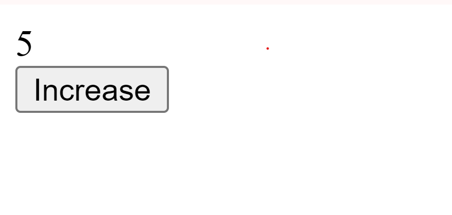
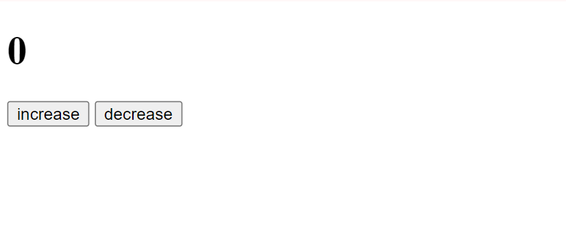

# MERN-CODING-QnA

#BUTTON


```html
<!DOCTYPE html>
<html lang="en">
<head>
    <meta charset="UTF-8">
    <meta name="viewport" content="width=device-width, initial-scale=1.0">
    <title>Increment Value on Button Click</title>
    
</head>
<body>
    <div class="counter" id="counter">0</div>
    <button class="button" id="incrementButton">Increase</button>
    <script src="script.js"></script>
</body>
</html>
```


```javascript


  let counterValue = 0;
  const counterElement = document.getElementById("counter");
  const incrementButton = document.getElementById("incrementButton");

  function increment() {
    counterValue++;
    counterElement.textContent = counterValue;
  }

  incrementButton.addEventListener("click", increment);


  

```




```html
<!DOCTYPE html>
<html lang="en">
  <head>
    <meta charset="UTF-8" />
    <meta name="viewport" content="width=device-width, initial-scale=1.0" />
    <title>Document</title>
    <script src="script.js" defer></script>
  </head>
  <body>
    <h1 id="output">0</h1>
    <button id="inc">increase</button>
    <button id="dec">decrease</button>
  </body>
</html>
```


```javascript

let one = document.getElementById("output");
let two = document.getElementById("inc");
let three = document.getElementById("dec");

let count = 0;

function increment() {
  count++;
  // one.textContent = count;
  one.innerHTML =count;
  // one.innerText = count;
}

function decrement() {
  count--;
  one.textContent = count;
}

two.addEventListener("click", increment);
three.addEventListener("click", decrement);

```





---
---
---
---
---


# Simple HTML Form with Validation using JavaScript

## Example 1: Basic HTML Form with HTML5 Validation

Here’s an example of a simple HTML form with basic validation using HTML5:

```html
<!DOCTYPE html>
<html lang="en">
<head>
    <meta charset="UTF-8">
    <meta name="viewport" content="width=device-width, initial-scale=1.0">
    <title>Simple Form with Validation</title>
</head>
<body>
    <h2>Simple Form with Validation</h2>
    <form action="/submit" method="POST">
        <!-- Name Field (required) -->
        <label for="name">Name:</label>
        <input type="text" id="name" name="name" required>
        <br><br>

        <!-- Email Field (required, must be a valid email format) -->
        <label for="email">Email:</label>
        <input type="email" id="email" name="email" required>
        <br><br>

        <!-- Password Field (required, min length 8) -->
        <label for="password">Password:</label>
        <input type="password" id="password" name="password" minlength="8" required>
        <br><br>

        <!-- Age Field (optional, must be a number) -->
        <label for="age">Age (optional):</label>
        <input type="number" id="age" name="age" min="1">
        <br><br>

        <!-- Submit Button -->
        <input type="submit" value="Submit">
    </form>
</body>
</html>
```

### Key Features:
- **Required Fields**: Ensures the form won't submit without filling in the name, email, and password fields.
- **Email Validation**: Ensures the email entered is in the correct format.
- **Password Validation**: Enforces that the password must be at least 8 characters long.
- **Number Validation**: The age field uses `type="number"` and `min="1"` to accept only positive numbers.

---
---
---
---
---
# HTML + JAVASCRIPT


## Example 2: Form with Additional JavaScript Validation

Here’s an enhanced version of the previous form with JavaScript validation added for additional checks (e.g., custom password validation and age range checks):

```html
<!DOCTYPE html>
<html lang="en">
<head>
    <meta charset="UTF-8">
    <meta name="viewport" content="width=device-width, initial-scale=1.0">
    <title>Form with HTML5 and JavaScript Validation</title>
</head>
<body>
    <h2>Form with Validation</h2>
    <form id="myForm" action="/submit" method="POST">
        <!-- Name Field (required) -->
        <label for="name">Name:</label>
        <input type="text" id="name" name="name" required>
        <br><br>

        <!-- Email Field (required, must be a valid email format) -->
        <label for="email">Email:</label>
        <input type="email" id="email" name="email" required>
        <br><br>

        <!-- Password Field (required, min length 8) -->
        <label for="password">Password:</label>
        <input type="password" id="password" name="password" minlength="8" required>
        <br><br>

        <!-- Age Field (optional, must be a number between 1 and 120) -->
        <label for="age">Age (optional):</label>
        <input type="number" id="age" name="age" min="1" max="120">
        <br><br>

        <!-- Submit Button -->
        <input type="submit" value="Submit">
    </form>

    <script>
        document.getElementById('myForm').addEventListener('submit', function(event) {
            // Custom password validation (must include at least one number and one uppercase letter)
            const password = document.getElementById('password').value;
            const passwordRegex = /^(?=.*\d)(?=.*[A-Z])/;
            if (!passwordRegex.test(password)) {
                alert('Password must contain at least one number and one uppercase letter.');
                event.preventDefault(); // Prevent form submission
                return;
            }

            // Custom age validation (must be between 1 and 120)
            const age = document.getElementById('age').value;
            if (age && (age < 1 || age > 120)) {
                alert('Age must be between 1 and 120.');
                event.preventDefault(); // Prevent form submission
                return;
            }

            // If all validations pass, form will be submitted
            alert('Form submitted successfully!');
        });
    </script>
</body>
</html>
```

### Additional Features with JavaScript:
- **Password Custom Validation**: Ensures the password contains at least one number and one uppercase letter.
- **Age Validation**: JavaScript checks if the value entered is between 1 and 120.
- **Alert on Validation Failure**: Shows an alert and prevents form submission using `event.preventDefault()`.

---
---
---
---
---

# FOR SIMPLE CODE:::::

### SAME CODE AS ABOVE BUT DIFFERNENT IS THAT 
### IN JS CODE WRITE SEPERATE FUNCTION THEN ADD/USE (LOOK SIMPLE)


## Example 3: Refactored JavaScript Code with Separated Functions

Here’s how you can refactor the JavaScript code to separate the validation logic into distinct functions and bind those functions in the `addEventListener`:

```html
<!DOCTYPE html>
<html lang="en">
<head>
    <meta charset="UTF-8">
    <meta name="viewport" content="width=device-width, initial-scale=1.0">
    <title>Form with HTML5 and JavaScript Validation</title>
</head>
<body>
    <h2>Form with Validation</h2>
    <form id="myForm" action="/submit" method="POST">
        <!-- Name Field (required) -->
        <label for="name">Name:</label>
        <input type="text" id="name" name="name" required>
        <br><br>

        <!-- Email Field (required, must be a valid email format) -->
        <label for="email">Email:</label>
        <input type="email" id="email" name="email" required>
        <br><br>

        <!-- Password Field (required, min length 8) -->
        <label for="password">Password:</label>
        <input type="password" id="password" name="password" minlength="8" required>
        <br><br>

        <!-- Age Field (optional, must be a number between 1 and 120) -->
        <label for="age">Age (optional):</label>
        <input type="number" id="age" name="age" min="1" max="120">
        <br><br>

        <!-- Submit Button -->
        <input type="submit" value="Submit">
    </form>

    <script>
        // Function to validate the password
        function validatePassword() {
            const password = document.getElementById('password').value;
            const passwordRegex = /^(?=.*\d)(?=.*[A-Z])/;
            if (!passwordRegex.test(password)) {
                alert('Password must contain at least one number and one uppercase letter.');
                return false; // Return false if validation fails
            }
            return true; // Return true if validation passes
        }

        // Function to validate the age
        function validateAge() {
            const age = document.getElementById('age').value;
            if (age && (age < 1 || age > 120)) {
                alert('Age must be between 1 and 120.');
                return false; // Return false if validation fails
            }
            return true; // Return true if validation passes
        }

        // Event listener for form submission
        document.getElementById('myForm').addEventListener('submit', function(event) {
            // Run both validations
            if (!validatePassword() || !validateAge()) {
                event.preventDefault(); // Prevent form submission if validation fails
            } else {
                alert('Form submitted successfully!');
            }
        });
    </script>
</body>
</html>
```

### Refactor Explanation:
- **`validatePassword()`**: Checks whether the password meets the custom criteria (contains at least one number and one uppercase letter).
- **`validateAge()`**: Ensures the age entered is between 1 and 120.
- **Form Submission Event Listener**: Calls both validation functions, and if any validation fails, the form submission is prevented.

This way, the validation logic is modular, and you can reuse or test individual functions easily.

---
---
---
---
---
---
---


